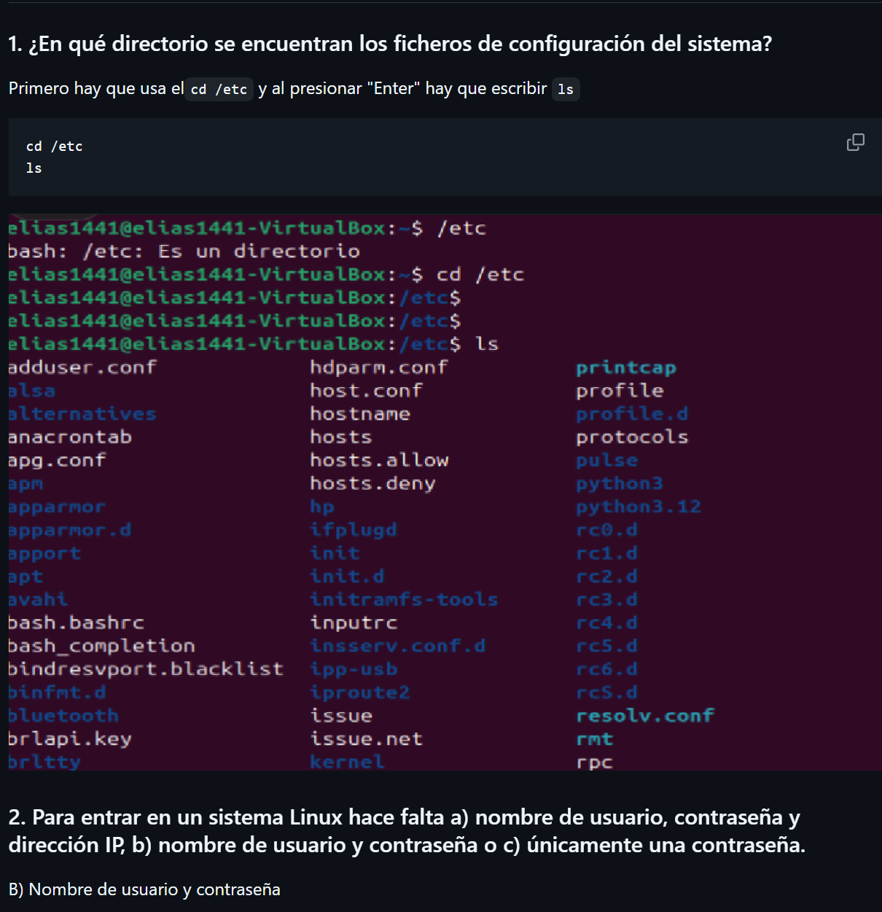

# TAREA REPOSITORIO

## Perdí la gran mayoría de imágenes y era imposible hacerlo a estas alturas, pero hay muestras de que se hacerlo

### Crear una rama para un bloque de ejercicios

### Copiar en la carpeta correspondiente el código .md y las imágenes asociadas.

### Hacer el commit en local y subir al remoto.

### Comprobar que en el remoto se lee correctamente el archivo con las imágenes asociadas. 

